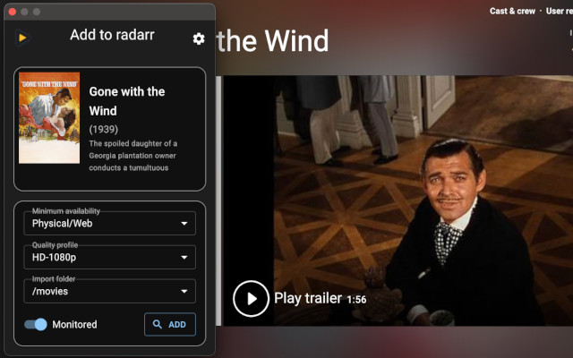

# Magnetarr

Browser extension for adding movies to [Radarr](https://radarr.video) or Series' to [Sonarr](https://sonarr.tv) while browsing IMDB, inspired by [Pulsarr](https://github.com/roboticsound/Pulsarr), completely rewritten in react.
- [Chrome](https://chrome.google.com/webstore/detail/pulsarr/dcildkalkckjjdfpgagmnbbfooogopkd)



## TODO
- First release on chrome store
- Add other websites support: Rotten tomatoes, TVDB, tmdb, trakt...
- Multi browser support (Firefox/Safari/ios)

## Development

The extension is built in the `release` folder, which is the folder to load as unpacked extension for tests. 

### Build the extension

```bash
npm run build
```

### Build a release
This will clean all older artefacts before building

```bash
npm run release
```

### Start development build

Start a watch daemon that will rebuild the extension upon changes in the source folder.

```bash
npm run dev
```


## References
- [Pulsarr](https://github.com/roboticsound/Pulsarr)
- [Radarr](https://github.com/Radarr/Radarr)
- [Sonarr](https://github.com/Sonarr/Sonarr)
- [Parcel](https://parceljs.org)
- [Chrome extension API](https://developer.chrome.com/docs/extensions/reference/api/)

Bug Reports/Feature Requests https://github.com/vche/magnetarr
