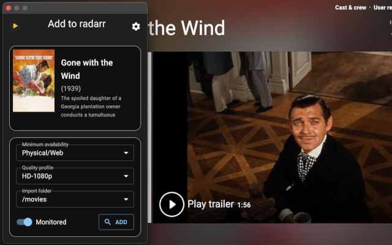

# Magnetarr

Browser extension for adding movies to [Radarr](https://radarr.video) or Series' to [Sonarr](https://sonarr.tv) while browsing [imdb.com](https://www.imdb.com), [thetvdb.com](https://www.thetvdb.com/), [themoviedb.org](https://www.themoviedb.org/), inspired by [Pulsarr](https://github.com/roboticsound/Pulsarr), completely rewritten in react.
- [Chrome](https://chromewebstore.google.com/detail/magnetarr/makjonablkcafdpkhfllblcmccgaahil)
- [Firefox](https://addons.mozilla.org/en-US/firefox/addon/magnetarr/)
- iOS/OSX Xcode project provided for anyone to build and run locally (follow instructions [here](https://developer.apple.com/documentation/safariservices/safari_web_extensions/running_your_safari_web_extension)), but the extension is not distributed on the app store (i'm not paying the enrollment just for this:P)
  - To build the xcode project you must first [build the extension](<README#Build the extension>)



## Development

The extension is built in the `release` folder, which is the folder to load as unpacked extension for tests.
Prerequisite: install npm (`brew install node` on osx, or [instructions for your platform](https://docs.npmjs.com/downloading-and-installing-node-js-and-npm))
### Build the extension

For the first run:
```bash
npm install
```

To build the extension:
```bash
npm run build
```

This will also link the source folder in the release folder, allowing packaging the exctension and building the xcode project

### Build a release
This will clean all older artefacts before building, and pack the built extension to a zip

```bash
npm run release
```

This actually does a `npm run clean`, `npm run build`, and `npm run pack`

### Start development build

Start a watch daemon that will rebuild the extension upon changes in the source folder.

```bash
npm run dev
```


## References
- [Pulsarr](https://github.com/roboticsound/Pulsarr)
- [Radarr](https://github.com/Radarr/Radarr)
- [Sonarr](https://github.com/Sonarr/Sonarr)
- [Parcel](https://parceljs.org)
- [Chrome extension API](https://developer.chrome.com/docs/extensions/reference/api/)

Bug Reports/Feature Requests https://github.com/vche/magnetarr
